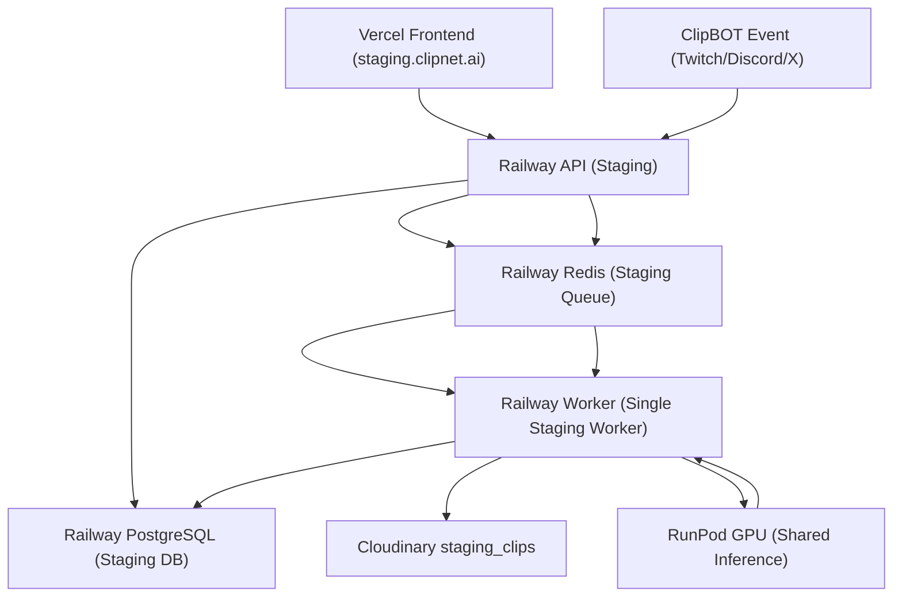

# CLIPNET Phase 1 Staging Overview

This README explains the **Phase 1 staging architecture** so someone new to ClipNET can see:
- **Which component does what**
- **Where a request or job is processed first, second, third, and so on**

---

## Components

- **Vercel Frontend (Staging)**
  - URL: `staging.clipnet.ai`
  - Branch: `develop`
  - Talks to the **Railway Staging API**.

- **Railway API (Staging API Server)**
  - Handles all HTTP requests from the frontend and external integrations.
  - Routes:
    - **Clip routes** (create/update/list clips)
    - **User routes** (auth, profile)
    - **OAuth routes** (using staging OAuth keys)
    - **ClipBOT command routes** (Twitch/Discord/X events)
  - Reads/writes to **Staging PostgreSQL**.
  - Enqueues work into **Staging Redis**.

- **Railway Worker (Single Staging Worker)**
  - **Only one** worker in Phase 1 staging.
  - Pulls jobs from **Staging Redis** and executes the entire ClipNET pipeline:
    - FFmpeg processing
    - Whisper batching
    - BLIP/CLIP scoring
    - Cloudinary uploads
    - Template tagging & metadata
    - Clip creation flow
    - Auto-posting jobs
    - ClipBOT posting/voting/notification jobs
    - Retry logic and sequential job handling

- **Railway Redis (Staging Queue)**
  - **Single Redis instance** per environment.
  - Acts as the **job queue / waiting room** for work created by the API.
  - Stores job types such as:
    - `clip:process`
    - `ffmpeg:polish`
    - `ml:score`
    - `whisper:batch`
    - `clipbot:post`
    - `clipbot:notify`
    - `post:youtube`
    - `post:tiktok`

- **Railway PostgreSQL (Staging DB)**
  - Stores staging data:
    - Users & OAuth tokens
    - Clips & segment metadata
    - Scoring metadata
    - ClipBOT state

- **Cloudinary (Staging Folder)**
  - Staging uploads go to: `/staging_clips/*`.
  - Production uploads go to: `/prod_clips/*`.

- **RunPod GPU (Shared Inference Server)**
  - Single GPU environment shared by **staging and production**.
  - Runs:
    - Whisper
    - BLIP
    - Motion detection
    - CLIP fallback
  - Staging is isolated via configuration (paths/namespaces), not a separate GPU.

---

## End-to-End Flow (Mermaid)

---

## Step-by-step: What happens first, second, third, fourth

### 1. User or ClipBOT sends a request

- **Frontend user**: interacts with `staging.clipnet.ai` → request goes to **Railway Staging API**.
- **ClipBOT event**: Twitch/Discord/X sends a webhook/command → hits **Railway Staging API**.

### 2. API validates, stores, and enqueues

- The **Staging API**:
  - Validates the request and user/auth state.
  - Reads/writes initial records to **Staging PostgreSQL** (e.g., create a clip record).
  - Enqueues one or more jobs into **Staging Redis** (e.g., `clip:process`, `ml:score`, `clipbot:post`).

### 3. Redis holds jobs until the worker is ready

- **Staging Redis** acts as the **waiting room**:
  - Jobs sit in Redis queues until the worker is ready to process them.
  - There is **one Redis instance** for all staging jobs.

### 4. Single staging worker processes jobs

- The **single Railway Staging Worker** pulls jobs from Redis and executes the pipeline:
  - Runs FFmpeg / ML / upload / ClipBOT logic as needed.
  - Writes results and status updates back into **Staging PostgreSQL**.
  - Uploads media to **Cloudinary `/staging_clips/*`**.
  - Calls **RunPod GPU** for heavy ML inference.

### 5. Data and UI update

- Once the worker finishes:
  - **Staging DB** contains updated clip metadata, scores, and ClipBOT state.
  - **Cloudinary** has the processed clip in the staging folder.
  - The **frontend** fetches updated data from the **Staging API**, which reads from **Staging DB**.

This flow ensures that anyone looking at the system can see **where a request starts, which component processes it next, and how it moves through API → Redis → Worker → DB/Cloudinary/GPU → back to the frontend**.
